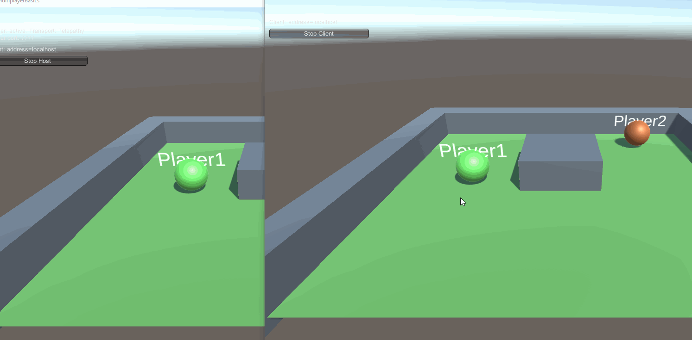

# MultiplayerBasic-Photon-Unity
This is just a simple test Prototype to connect between projects and have updated variables.
Photon is a multiplayer API which allows online and lan gameplay.

Portfolio: https://frozenwispstudios.github.io/Portfolio/  
Twitter: https://twitter.com/_frozenwisp_  
Instagram: https://www.instagram.com/frozenwispstudios/  
Github: https://github.com/frozenwispstudios  
Gitlab: https://gitlab.com/frozenwispstudios  
Itch.io: https://frozenwipstudios.itch.io/  
Linkedin: https://www.linkedin.com/in/ben-mcneill-144608188/  

